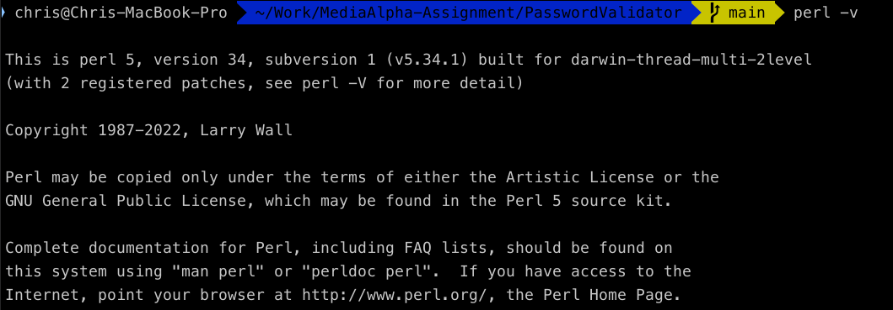
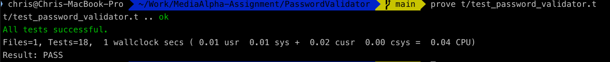
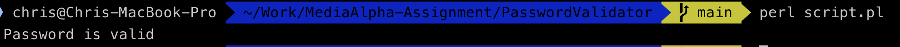
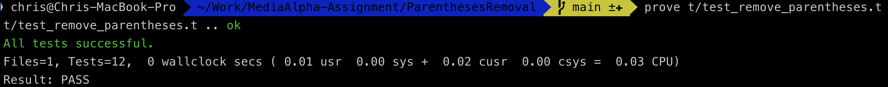
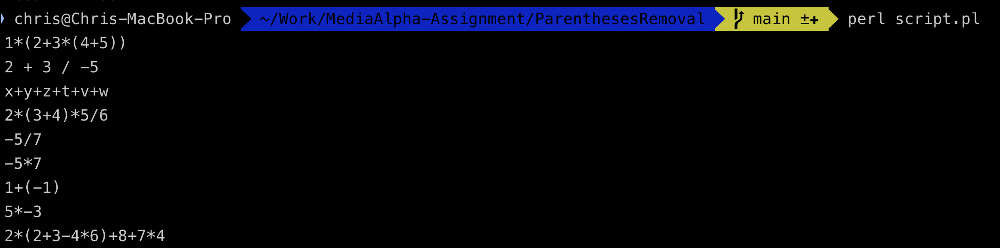

# MediaAlpha-Assignment
  * env: 
  
  
## 1. Password Validator
  * A Perl function that takes in a password and checks whether it's valid.
  * Testing demonstration
  
  * Executation demonstration
  

## 2. Parentheses Removal
  * Given a string containing an expression, return the expression with unnecessary parentheses removed.  
  * Testing demonstration
  
  * Executation demonstration
  